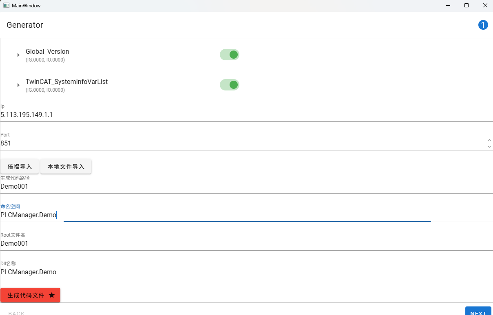

<h1 align="center">Beckhoff PLC Manager</h1>

<p align="center">快速构建倍福PLC数据映射的工具</p>

## 数据结构接口说明

### 数据结构映射
倍福的数据类型系统可以将数据划分为基本数据、结构数据、基本数组、结构数组四种数据类型

基本数据：即 bool byte ushort short uint int ulong long float double string 这11种数据
| C#基本数据 | 对应PLC端数据 |
| --- | --- |
| bool | BIT/BOOL |
| byte | BYTE/USINT |
| sbyte | SBYTE/SINT |
| short | WORD/INT |
| ushort | UINT |
| int | DWORD/DINT |
| uint | UDINT |
| long | LWORD/LINT |
| ulong | ULINT |
| float | REAL |
| double | LREAL |
| string | STRING（特殊地，占用的字节数已知） |

结构数据：即基本数据或其他结构数据嵌套组合成的数据

数组：与C#原生数组类似，唯一的不同是：它的子项数量在数据声明时就固定了

PLC Manager 采用与电气PLC程序中对应的数据结构映射来实现对PLC数据的读写等操作，举例说明：针对电气PLC程序中的变量：GVL_Motion.Motion[0].AXIS.NcToPlc.ActPos，在PLC Manager中存在相同的变量接口（索引方式）即Root.GVL_Motion.Motion[0].AXIS.NcToPlc.ActPos。
这里的ActPos在PLC程序中是一个double变量，但在PLC Manager中，它以接口IBaseData<double>的形式存在，这是因为上位机针对该变量需要进行读取、写入、或事件订阅等行为，而不是把它单纯地当作变量来读写。
另外，对于xxx.xxx...这样的调用，取索引的操作虽然会消耗微乎其微地cpu操作时间，但如果需要优化，可以考虑将xxx.xxx变量赋于一个临时变量上，后续对该变量进行其他操作便不涉及到取索引的操作，举例如下：
```CSharp
var axis0ActPos = Root.GVL_Motion.Motion[0].AXIS.NcToPlc.ActPos;
//axis0ActPos.Get();
//axis0ActPos.Set(1.23);
//...
```

### 数据操作接口列举
| 接口 | 说明 |
| --- | --- |
| Data { get; } | 当前数据对应的上位机映射内存位置，这个方法可以拿到上位机最近一次主动或被动从PLC中读到的数据，并且不涉及IO交互，不阻塞线程 |
| Get | 主动读取PLC中的数据（相较于Data接口，该接口涉及到IO操作，会阻塞上位机线程，但可以获取到当前PLC中的无延迟最真实数据），具有TryGet版本及Async版本 |
| Set | 主动设置PLC中的数据，具有TryGet版本及Async版本 |
| T this[int index] { get; } | 获取数组类型的index对应的子项数据接口 |
| GetItem | 类似Get方法，针对数组类型，获取index对应的子项，具有TryGet版本及Async版本 |
| SetItem | 类似Set方法，针对数组类型，获取index对应的子项，具有TryGet版本及Async版本 |

### 数据响应事件接口
	原理简单介绍
        如果需要在程序中获取 PLC 的值的变化，使用异步读取访问是非常低效的，因为该功能必须周期性地调用（例如通过定时器触发的轮询）。与其使用拉取（读取）模型，倍福PLC底层实现了一种推送模型。这意味着通知由倍福PLC端触发，并在上位机端形成消息/事件。
| 模型 | 响应特点 | 资源 |
| --- | --- | --- |
| 推模型 | 时效性好 | 消耗PLC资源 |
| 拉模型 | 时效性差 | 消耗上位机资源 |

在兼顾两种模型的基础上，提供了一套事件响应接口，该接口位于每一个数据结构中
| 接口 | 说明 |
| --- | --- |
| IObservable | 当前数据的事件变化接口，以Observable模型的方式提供 |
| Refresh | 主动拉取当前数据 |
| CheckAndNotify | 检查当前数据是否发生变化，并将变化传递到Observable接口中 |
| SelfNotify | 当设置该属性为true时，打开当前数据的推模型，将Observable接口交给PLC进行数据推送，此时Refresh和CheckAndNotify不起作用。注意：这个属性必须在本组件调用Connect成功之后设置，否则PLC推流资源无法正常打开，会导致没有事件发出 |

IObservable接口举例：
```CSharp
//阻塞直到0号轴到Target位变化
bool Axis0InTargetPositionBlocking(Cancellation token)
{
    TaskCompleteSource<double> actPosChanged = new TaskCompleteSource<double>();
    using(Root.GVL_Motion.Motion[0].AXIS.Status.InTargetPosition.Subscribe((m_0)=>
    {
        actPosChanged.TrySetResult(m_0);
    }))
    {
        actPosChanged.Task.Wait(token);
        return actPosChanged.Task.Result;
    }
}
```

### CircleManager
寄生在PLC数据的根结构上，提供了基于拉模型的数据同步机制。首先需要把希望进行同步的数据添加到接口中，然后把同步机制打开，它会自动循环调用数据及数据子项的Refresh和CheckAndNotify方法，并通过对应的IObservable接口发出事件。

### 数据结构接口
每个数据结构都有以下三个接口，便于界面程序获取当前数据在数据结构树上的位置
| 接口 | 说明 |
| --- | --- |
| Parent | 当前数据结构的上一级数据索引 |
| Children | 当前数据结构的所有子项 |
| Name | 当前数据实例在PLC端使用的名称 |

## 工具说明
### 结构工具说明
	界面简单阐述

	引用时添加相应的package
    在.NetFramework 4.6.1版本的启动项目中使用到PLCManager，必须手动安装下面几个包，以及其所附带的一系列依赖包：
    Beckhoff.TwinCAT.Ads
    Beckhoff.TwinCAT.Ads.Reactive
    新增直接生成dll功能，为了启用该功能，需要把当前路径的的PLCManager.rar解压到生成路径中，把生成代码路径改为PLCManager\xxx，其中xxx是动态生成代码的目录，可随意编写

### 测试工具说明
	界面简单阐述

	测试读取和写入
    点击Get、Set可测试每次读取写入指令的持续时长，并在右边的图表上显示出来

## 测试结果
### Get和GetAsync
    单次调用GetAsync方法的耗时长度明显高于Get方法， 这可能是由于下面几种原因：
    1.上下文切换开销：异步操作通常涉及到线程或任务的切换，这会产生一定的上下文切换开销。尽管这些开销通常很小，但在高频操作中可能会累积并显得明显。
    2.调度延迟：异步操作依赖于任务调度器来管理任务的执行顺序和时机。如果系统负载较高，调度器可能会导致任务的延迟执行。
    3.回调或Promise处理：在异步操作中，通常需要处理回调函数或Promise，这些额外的逻辑可能会引入一些延迟。
    4.资源竞争：异步操作可能会导致多个任务同时请求相同的资源（如CPU、内存、I/O设备），从而引发资源竞争，导致性能下降。
    5.错误处理和重试机制：异步接口可能内置了更复杂的错误处理和重试机制，以提高操作的可靠性，这也可能导致响应时间增加。
    因此，在需要快速获取单个数据的场景下，应尽量使用非异步的版本。
    但需要注意的是，异步的优势在于并发，即异步接口的设计初衷并不是为了加快单个操作的速度，而是为了提高系统的整体吞吐量和响应能力。通过非阻塞的方式，异步接口可以更有效地利用系统资源，尤其是在涉及I/O操作时。
### 小数据与大型结构体数据
    测试Get大结构体数据时，耗时明显高于Get单个基础数据类型，这表明大结构数据传输需要的时间更长，小结构数据传输所需时间更短。需要酌情调用相应的接口。
    另外测试中发现，结构体太大时不宜将其绑定到推模型上，会导致PLC与上位机之间通信出现中断。
## 总结
### 优点
	1.针对倍福PLC可以快速实现PLC数据结构
	2.方案可以延申到其他PLC设备
	3.采用统一的结构模型，来实现软件与电气之间的领域共用语言，减少沟通成本
### 局限性
	1.硬件服务化较复杂
	2.针对轴、IO的高度同质化实现，并没有固定的接口，进一步地接口化较难。但可以与电气部门沟通，将轴、IO的结构体标准化化，框架固定，则后期可以通过代理实现统一的接口